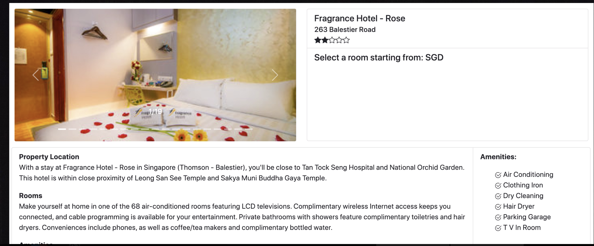
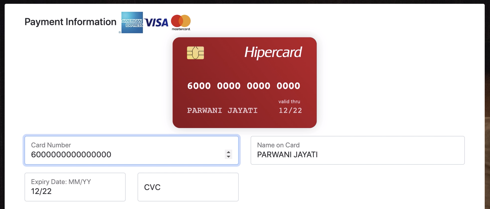
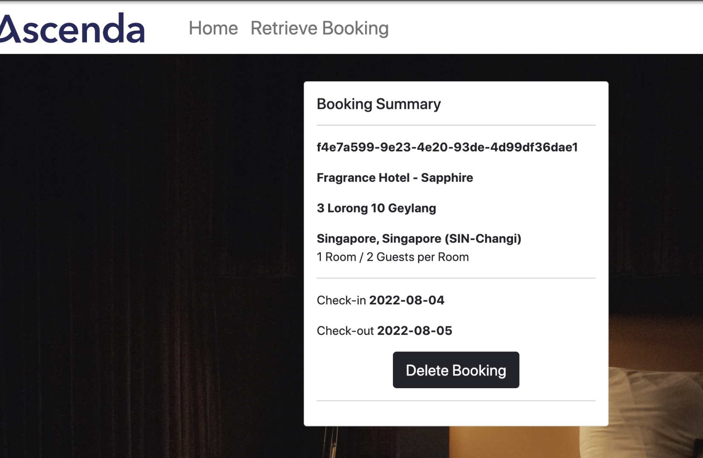

<!-- 
## Code block test

```css
.AClass .Subtitle {
  margin: -0.5rem 0 0 0;
  font-weight: 700;
  font-size: 1.25rem;
  line-height: 1.5rem;
}

.AnotherClass p {
  font-size: 1.125rem;
  margin-bottom: 2rem;
}

.AThirdClass {
  display: flex;
  justify-content: flex-start;
  align-items: center;
}

@media (max-width: 768px) {
  .AClass {
    flex-direction: column;
  }
  .AnotherClass {
    display: block;
  }
}
```

Inline code: `print()` -->

This project is a hotel booking webapp implementing the MERN Stack. Features include fast autocomplete search for hotels around the world, presented in order of competitive pricing. Map implementation, credit card payment API and database integration and encryption. Travellers can easily track their bookings through our booking id features. We achieved three non-functional requirements- speed, accuracy, data security so travellers to book their trips with comfort through our great user experience. The app was tested through selenium automated testing, fuzzing and other white-box and black box component and unit testing. 




## The Agile Framework

Our group selected the Agile Framework as the software development process for the project.
Jira, an Agile project management software developed by Atlassian, was used to implement the Agile method. The team adopted the Scrum framework to plan individual sprints. Each sprint lasted around 1 to 2 weeks.



Adopting the Agile Method presented a few risks and challenges given that our team only had three members. Throughout the project we ensured to minimise these risks and their impact on the quality of our work:
Being open to changing requirements would mean that it would be difficult to provide long-term predictions and insights of the final product. To minimise this, early UI mockups and wireframes were drawn up to give the group a rough idea of what the final product could be like.
		
Minimal planning at the beginning of the project could lead to the team being sidetracked from the main scope of the project. This posed less of a problem for us since the requirements were clearly defined at the start of the project. However, the abundance of freedom in designing the web application (such as picking the tech stack, and how we want our features to be accessed by the user) meant that it was also incredibly easy to get sidetracked and focus on less important tasks, like implementing the bonus features.
			
It requires developers to be less “lazy” and output more “high quality” work since the workflow relies on the developers to be consistent and fast-paced. This was especially important since our group only consisted of three people, and we would hold weekly or bi-weekly sprints. Ensuring that the tasks allocated to us were fulfilled or had progress made at the end of every sprint was not easy..


### My Reflection


This has been fruitful and a fairly successful project journey. We were able to implement all the features we aimed for. For some of us in the group we had no experience with software development, and this was a great opportunity to learn and put the MERN stack into practice. Additionally we were able implement software testing concepts learnt in class such as Unit Testing, System Testing (such as Black-box Testing) and Fuzzing.

We learnt to differentiate between the non-functional requirements such as speed, accuracy and security, and the functional requirements of the project. However, for a project to be successful, emphasis has to be placed on both types of requirements during software development.

#### Looking Back at My Journey




Another lesson learnt was how to work collaboratively in a team, while using the same skeleton for coding. Initially, it was not easy to keep track of changes as we were all coding different parts of the web application. However, as the project started coming together, through code management on Github (tracking commits, creating branches) as well as effective communication at the end and start of every Scrum sprint, our code became more organised and there was hardly any confusion on the progress of each member, which could have been a likely problem given the scale of this project and the various components and features that require implementation. 

Hope you enjoyed this reflection of mine! A lot more to come. Keep Waiting. 
